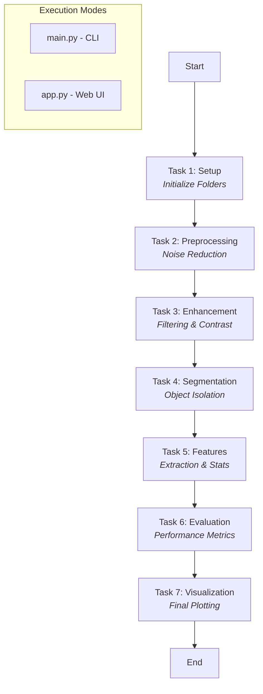

# 📸 Intelligent Image Processing System

An end-to-end, modularized image processing pipeline designed for advanced computer vision tasks. This project demonstrates a comprehensive workflow from image acquisition to feature extraction and visualization, accessible via both Command Line and a Web Interface.

---

## 🚀 Overview

The **Intelligent Image Processing System** provides a structured approach to image analysis. It is divided into 7 distinct tasks, each handling a specific stage of the pipeline. This modular design ensures that each component can be independently tested, optimized, and integrated.

### Key Features:
- **Modular Pipeline:** 7-stage processing flow.
- **Dual Interface:** Run via CLI for batch processing or Web UI for interactive use.
- **Advanced Techniques:** Noise reduction, edge detection, segmentation, and feature extraction.
- **Real-time Visualization:** Integrated plotting and metric evaluation.

---

## 🛠️ Technology Stack

- **Language:** 
- **Python Version:** `3.8+` (Tested on 3.10 and 3.13)
- **Frameworks & Libraries:**
  - `OpenCV`: Core image processing.
  - `Flask`: Web interface backend.
  - `NumPy` & `SciPy`: Numerical computing.
  - `scikit-image` & `scikit-learn`: Advanced segmentation and analysis.
  - `Matplotlib`: Data visualization.

---

## 📊 System Flow Chart



---

## ⚙️ How to Use

### 1. Installation

First, clone the repository and install the required dependencies:

```bash
git clone https://github.com/SnehaParmar10/Intelligent-Image-Processing.git
cd Intelligent-Image-Processing
pip install -r requirements.txt
```

### 2. Running the Pipeline (CLI)

To execute the entire image processing sequence automatically:

```bash
python main.py
```
*This will run all 7 tasks and save the outputs in the `outputs/` directory.*

### 3. Running the Web Interface

To use the graphical interface via your browser:

```bash
python app.py
```
*Once running, open `http://127.0.0.1:5000` in your browser. You can upload an image and see each step of the processing pipeline.*

---

## 📁 Project Structure

| File | Description |
| :--- | :--- |
| `task1_setup.py` | Environment initialization and directory creation. |
| `task2_preprocessing.py` | Image acquisition and initial cleaning. |
| `task3_enhancement.py` | Quality improvement and filtering. |
| `task4_segmentation.py` | Dividing the image into meaningful regions. |
| `task5_features.py` | Characterizing objects via numerical data. |
| `task6_evaluation.py` | Assessing accuracy and processing metrics. |
| `task7_visualization.py` | Generating visual results and graphs. |
| `main.py` | Sequential execution of all tasks. |
| `app.py` | Flask application for the web interface. |

---

## 🌟 Acknowledgments
Developed by **Sneha Parmar** as part of an Intelligent Image Processing assignment.
